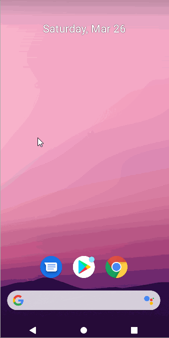

# Project 3 - *Parstagram: Instagram Clone*

**Parstagram** is a photo sharing app similar to Instagram but using Parse as its backend.

Time spent: **5** hours spent in total

## User Stories

The following **required** functionality is completed:

- [X] User can sign up to create a new account using Parse authentication.
- [X] User can log in and log out of his or her account.
- [X] The current signed in user is persisted across app restarts.
- [X] User can take a photo, add a caption, and post it to "Instagram".

The following **optional** features are implemented:

- [X] User sees app icon in home screen and styled bottom navigation view
- [ ] Style the feed to look like the real Instagram feed.
- [ ] After the user submits a new post, show an indeterminate progress bar while the post is being uploaded to Parse.

## Video Walkthrough

Here's a walkthrough of implemented user stories:

GIF created with [LiceCap](http://www.cockos.com/licecap/).

## Notes

One of challenges that I faced was to figure out how to hide the App Bar in the log in screen to make the login screen look more like the Instagram app.
